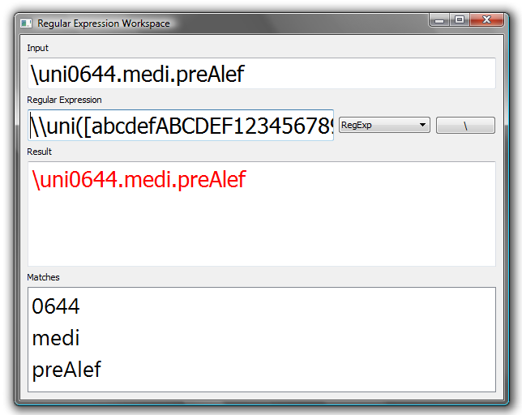

Introduction
------------

Regular Expression Workspace is a simple tool for writing regular expressions.

*   Write the input in the top box...
*   ...and the regular expression in the bottom box...
*   ...and it shows you the result as you type.
*   Various regular expression possibilities, as documented [here](http://developer.qt.nokia.com/doc/qt-4.7/qregexp.html#id-f8380a08-73ad-478e-bca8-0e49a1d8ceaa).
*   The default input & expression are the task that motivated me to write this in the first place.



Downloads
---------

Regular Expression Workspace is created with the [Qt application framework](https://www.qt.io/), released under the GNU Public License. That means, among other things, that you are free to download it and use it, but not to re-sell it.

I build in Windows with this, which assumes that Qt is installed and visible in your path:

```
qmake -config release
mingw32-make
```

Of course your system would have something different from “mingw32-make”—probably just “make”—if you are not building from Windows using MinGW.
